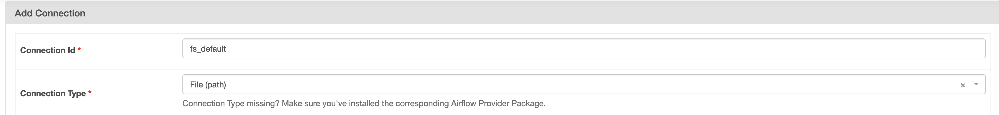

# ETL

## Running

To run the airflow deployment, use the main [deployment](https://github.com/Golden-Ratio-Analytic-Services/deployment) repository and then visit http://0.0.0.0:8080/login/

```bash
docker-compose up
```

Then, [add a new connection in the ui](https://airflow.apache.org/docs/apache-airflow/stable/howto/connection.html#creating-a-connection-with-the-ui) with the following parameters. **This must be done for the dags to run**.

The name is `fs_default` and of type File(path).



## DAGS

### process-highways

This dag is responsible for downloading highway geometries, saving them to disk in a database ready format, and loading them into the database.

### process-addresses

This dag downloads the address data and then inserts it into neo4j.

## Developing

Poetry is used to manage the dependencies and environment. To use, run

```
poetry shell
```

To exit, run `exit`.

### Linting

Before submitting code for review, lint it with the following commands

```python
python3 -m black .
```

```python
python3 -m isort .
```

### Pull Requests

Pull requests should be made into the `develop` branch from feature branches.
